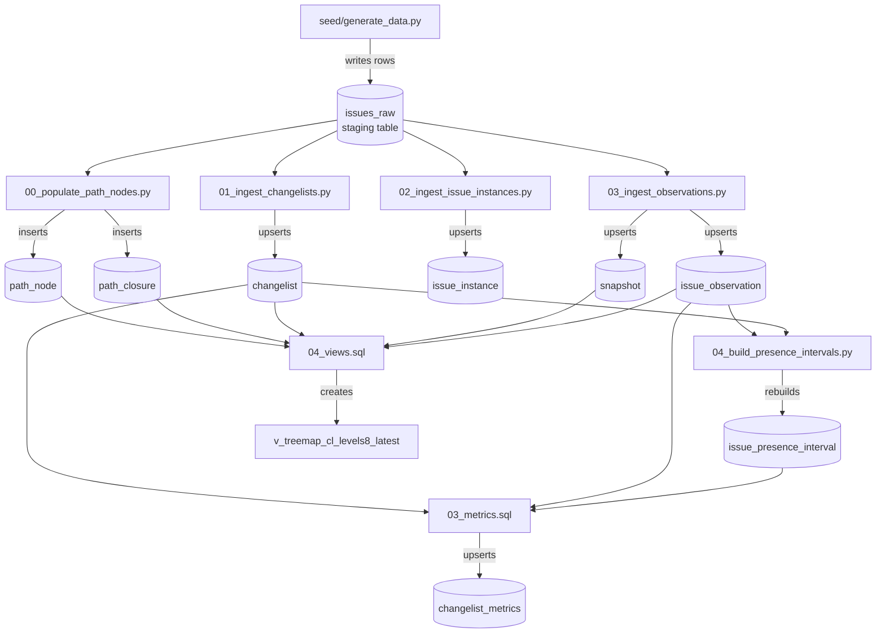
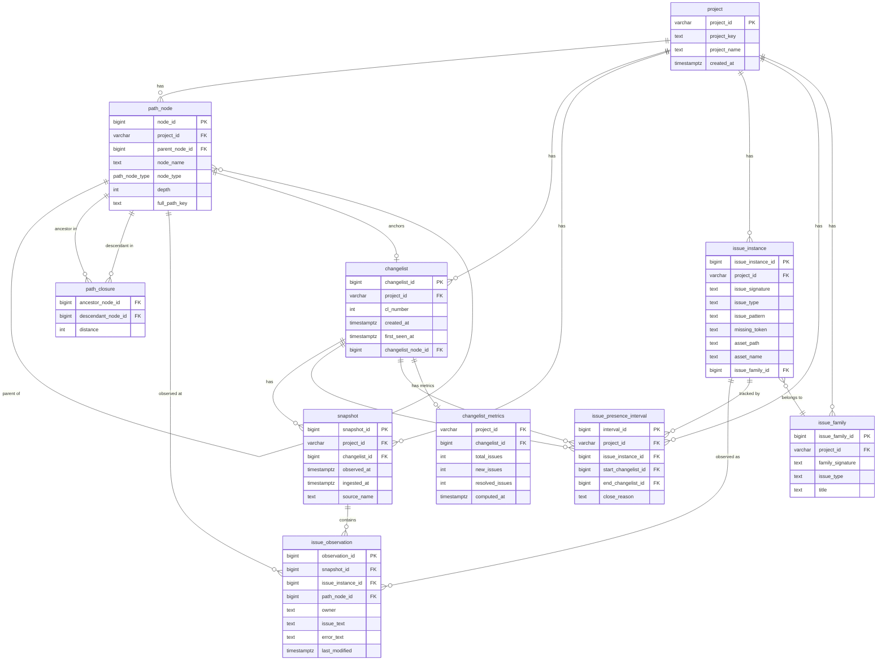

# Architecture

## Data Flow

---

## Entity Relationship Diagram

---

## Table Roles

| Table | Role | Written by |
|---|---|---|
| `issues_raw` | Staging: raw ingest rows, one per observation in source data | `seed/generate_data.py` |
| `project` | Root dimension; all FK chains start here | `seed/generate_data.py` |
| `path_node` | Adjacency list for the build-machine path hierarchy | `pipeline/00_populate_path_nodes.py` |
| `path_closure` | Materialised ancestor–descendant pairs (closure table) | `pipeline/00_populate_path_nodes.py` |
| `changelist` | One CL per project; links to its path_node in the hierarchy | `pipeline/01_ingest_changelists.py` |
| `snapshot` | One ingestion event per CL; separates observation time from CL time | `pipeline/03_ingest_observations.py` |
| `issue_instance` | Deduplicated issue identity (SHA-256 signature) | `pipeline/02_ingest_issue_instances.py` |
| `issue_observation` | Fact: issue seen at a path location in a snapshot | `pipeline/03_ingest_observations.py` |
| `issue_presence_interval` | Derived: contiguous CL runs per issue; open if `end_cl IS NULL` | `pipeline/04_build_presence_intervals.py` |
| `changelist_metrics` | Pre-aggregated total/new/resolved per CL | `postgres/sql/03_metrics.sql` |

---

## Key Constraints

| Constraint | Table | What it enforces |
|---|---|---|
| `uq_issue_instance` | `issue_instance` | One row per `(project_id, issue_signature)` — the hash is the identity |
| `uq_issue_observation` | `issue_observation` | No duplicate `(snapshot, issue, path_node)` triples |
| `uq_issue_interval_open` | `issue_presence_interval` | At most one open interval (NULL end) per issue at any time |
| `ck_interval_order` | `issue_presence_interval` | `end_cl >= start_cl` when not NULL — allows single-CL closed intervals |
| `uq_snapshot_unique` | `snapshot` | One snapshot per `(changelist_id, observed_at)` |
| `uq_changelist_per_project` | `changelist` | One CL number per project |
